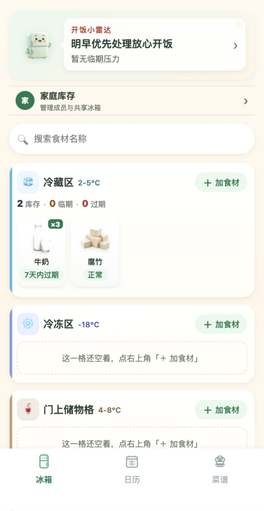
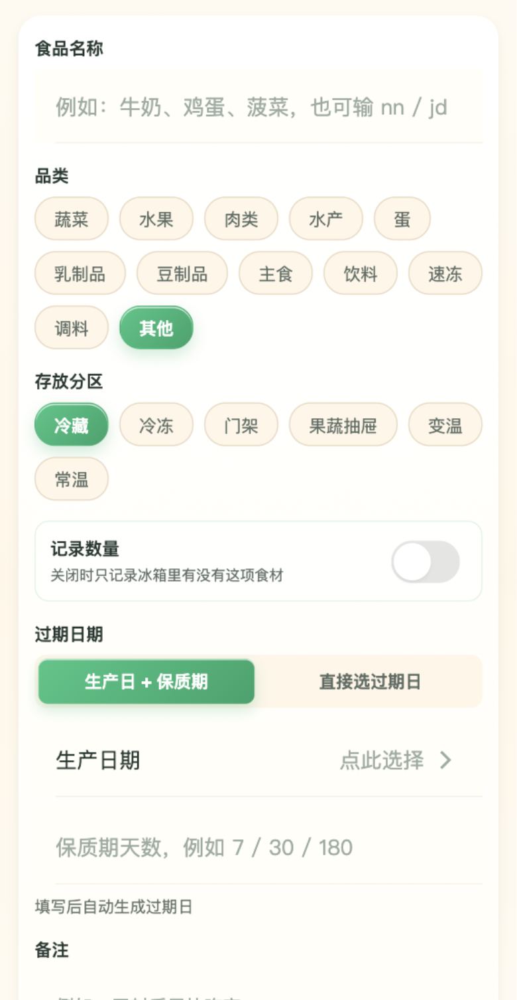
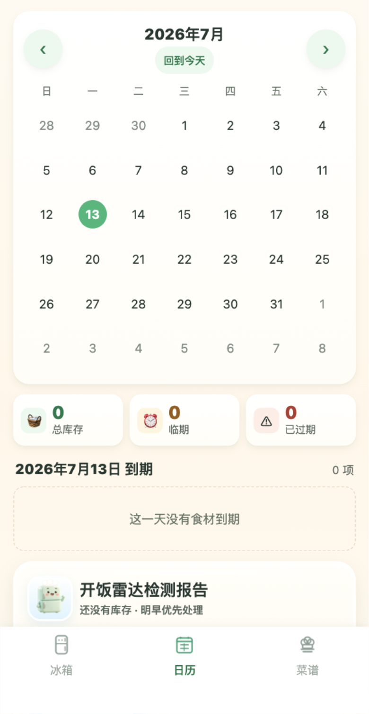

# 冰箱小雷达 · Fridge Radar（微信小程序）

冰箱小雷达是一个**家庭冰箱库存管理**微信小程序：记录食材、按 6 个分区存放、跟踪保质期、提醒临期与过期，并支持家庭成员共同维护私有库存。

> 当前开发版本为 **v2.0 家庭库存闭环版（M4 发布候选）**：数量由用户选择是否记录，食材可拖到餐盘“用掉”，并提供邀请制家庭共享。继续保持无登录页、无支付、无 AI、无公开 UGC，适配个人主体工具类小程序边界。

English name: Fridge Radar. 本项目为微信小程序原生开发，早期的 React/Vite H5 脚手架已彻底移除，仓库即纯小程序工程。

## 截图

<table>
  <tr>
    <td align="center">
      
      <br /><sub>6 分区库存首页</sub>
    </td>
    <td align="center">
      
      <br /><sub>可选数量与常温分区</sub>
    </td>
    <td align="center">
      
      <br /><sub>到期日历 + 开饭雷达</sub>
    </td>
    <td align="center">
      
      <br /><sub>私有家庭共享</sub>
    </td>
  </tr>
</table>

> 截图来自 2026-07-13 的 v2.0 开发版本，不包含用户账号、邀请口令或库存备注等敏感信息。

## 功能（v2.0 发布候选）

底部三个 Tab：**冰箱（首页）· 日历 · 菜谱**。

**首页**
- 6 个固定分区：冷藏区、冷冻区、门上储物格、果蔬抽屉、变温区、常温储物。
- 每个分区显示「库存 · 临期 · 过期」内联统计 + 横向食材卡片，右上角「＋ 加食材」直达添加。
- 吉祥物文案按库存状态（空 / 临期 / 过期 / 正常）动态显示。
- 搜索食材；点食材卡片查看详情（到期日、状态、备注），可编辑 / 删除。
- 可选择是否记录数量；记录时只显示 `×N`，不填写或展示单位。
- 长按食材卡片拖到餐盘完成“用掉”：有数量默认减 1，未记录数量或减到 0 时移出库存，并支持一次撤销。
- 食材缩略图按**品类 / 食材族群共用写实图**；**拍照录入接口已预留**（用户照片优先于系统图）。
- 底部「清空全部食品数据」（带二次确认）。

**日历**
- 月历视图标记到期日；总库存 / 临期 / 过期统计卡可展开清单。
- 选中日「到期」清单，可直接编辑 / 删除。
- **开饭雷达**：基于库存量、品类多样性、临期与过期风险的**纯本地评分**（可开饭指数），无任何云端 AI。

**菜谱**
- 占位页「菜谱搭配，敬请期待」（家常菜谱搭配方向，当前不提供任何生成功能）。
- 「隐私与数据」说明 + 查看隐私保护指引入口。

**家庭共享**
- 一个用户只加入一个家庭；创建者通过微信分享一次性邀请成员。
- 创建者可撤回邀请、移除成员；成员可共同查看和编辑家庭库存并主动退出。
- 不获取头像、昵称或手机号，不提供公开动态、评论、聊天或陌生人发现。
- 家庭数据只能通过 `familyInventory` 云函数访问，服务端从微信上下文读取 OPENID 并校验角色。

**工程**
- UI：TDesign 小程序组件 + 自定义「轻奢黏土」主题；已完成 WCAG 2.1 AA 无障碍整改（对比度、触控目标、`aria` 角色 / 标签、减少动效）。
- 体积：主包约 1.7MB；TDesign 通过**分包独立 npm**（`pkg-add`）放入分包，保证主包 < 2MB。

## Roadmap · 迭代方向

> v2.0 仍按个人主体工具类边界设计。AI、深度合成、拍照识别和支付不进入本版本。

| 阶段 | 方向 | 主体要求 | 备注 |
|---|---|---|---|
| v1.2 | 到期提醒、本地词库、样板冰箱和稳定性收口 | 已完成 | 个人主体稳定基线 |
| v2.0 | **家庭库存闭环**：可选数量、餐盘消耗、常温分区、私有家庭共享 | 提审准备 | 正式家庭云函数和集合权限已配置 |
| 后续候选 | 健康余额、AI、识别、会员与支付 | 暂不排期 | 需要重新验证需求和主体资质 |

## 技术栈

- 微信小程序原生（JavaScript / WXML / WXSS）
- 微信云开发 / Tencent CloudBase（云数据库 + 云函数）
- TDesign 小程序组件库（`pkg-add` 分包独立 npm）

云开发资源：

- AppID：`wx328e2b87665508e7`
- CloudBase 环境 ID：`cloud1-d3g4v0ms8ee56bd94`
- 云数据库集合：`items`、`reminders`；v2.0 新增 `families`、`familyMembers`、`familyInvites`、`inventoryEvents`
- 当前云函数：`getOpenId`、`sendExpiryReminders`；v2.0 新增 `familyInventory`。AI / 识别云函数仍为历史预留，不开放前端入口

> 以上 AppID 与环境 ID 是项目配置标识，不是可复用密钥。Fork 时请替换为自己的 AppID 与 CloudBase 环境。

## 仓库结构

```text
.
├── app.js / app.json / app.wxss      # 启动、页面/Tab 配置、全局样式
├── custom-tab-bar/                   # 自定义底部 TabBar（冰箱/日历/菜谱）
├── pages/                            # index 首页、calendar 日历、recipes 菜谱
├── pkg-add/                          # 分包：添加/编辑表单 + TDesign 独立 npm
├── services/                         # itemService / familyService / reminderService
├── utils/                            # constants / inventory / date / status / visualAssets
├── styles/                           # tokens、tdesign-theme 等共享样式
├── images/                           # 本地视觉素材（食材写实图、吉祥物、tabbar）
├── cloudfunctions/                   # CloudBase 云函数
├── docs/                             # 开源说明、CloudBase 设置、交付/治理文档
└── project.config.json               # 微信开发者工具配置（含分包独立 npm）
```

## 本地运行

1. 打开微信开发者工具，导入本仓库目录，使用项目内 `project.config.json`。
2. 确认识别到 `miniprogramRoot: "./"` 与 `cloudfunctionRoot: "cloudfunctions/"`。
3. 在 `pkg-add/` 下安装依赖并「构建 npm」（TDesign 走分包独立 npm）。
4. 编译运行。Fork 用户需配置自己的 CloudBase 环境，详见 [docs/CLOUDBASE_SETUP.md](docs/CLOUDBASE_SETUP.md)。

## 验证命令

本项目无构建步骤，提交前用 Node 语法检查关键脚本，并在微信开发者工具中编译运行 / 预览：

```bash
node --check app.js
node --check services/itemService.js
node --check services/familyService.js
node --check services/parseService.js
node --check services/reminderService.js
node --check utils/visualAssets.js
node --check utils/constants.js
node --check pages/index/index.js
node --check pages/calendar/calendar.js
node --check pages/recipes/recipes.js
node --check pages/family/family.js
node --check pkg-add/item-form/item-form.js
node --check cloudfunctions/familyInventory/index.js
node tests/inventory-domain.test.js
node tests/family-domain.test.js
```

## 当前不做

- 不做 Vercel / Supabase / Next.js / 独立后端 / Docker / 登录页。
- 不接真实条形码商品库；条形码入口已移除。
- 个人主体阶段不接 AI / 深度合成与微信支付（见 Roadmap）。
- v2.0 不做健康余额、公开社区、多家庭或复杂角色体系。
- AI、OCR、菜谱生成等能力一律留在云函数侧，前端不保存或暴露服务商 API key。

## 文档

- [NEXT_VERSION_GUIDE.md](NEXT_VERSION_GUIDE.md)：后续版本方向与图片资源治理
- [docs/handoff-index.md](docs/handoff-index.md)：UI 交付规格（全页面）
- [docs/a11y-checklist.md](docs/a11y-checklist.md)：无障碍整改清单（WCAG 2.1 AA）
- [docs/CLOUDBASE_SETUP.md](docs/CLOUDBASE_SETUP.md)：CloudBase 环境配置
- [docs/CLOUDBASE_V2_SECURITY.md](docs/CLOUDBASE_V2_SECURITY.md)：家庭共享安全规则、上线顺序和回滚边界
- [CONTRIBUTING.md](CONTRIBUTING.md) · [SECURITY.md](SECURITY.md) · [CHANGELOG.md](CHANGELOG.md)

## Contributing

Contributions are welcome. Please start by reading [CONTRIBUTING.md](CONTRIBUTING.md). Good first areas: 文档改进、配置说明修正、UI 文案优化、CloudBase 部署说明、可复现的小 bug 修复。

## Security

Please read [SECURITY.md](SECURITY.md) before reporting sensitive issues.

## License

MIT License. See [LICENSE](LICENSE).
