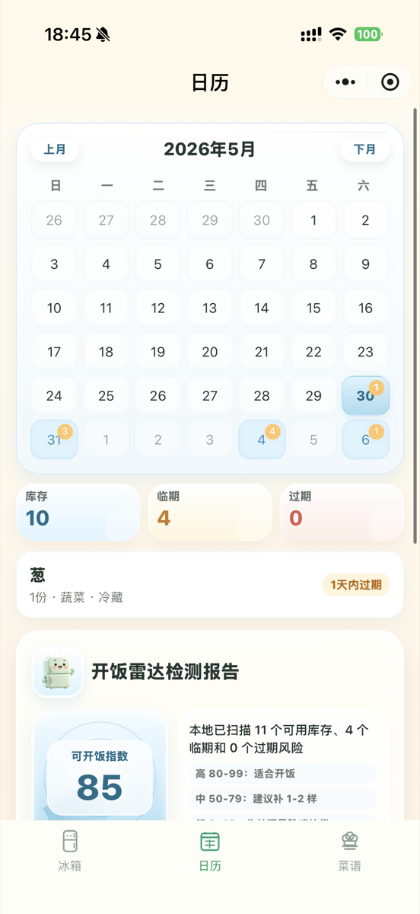
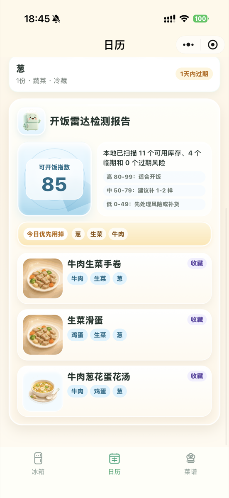
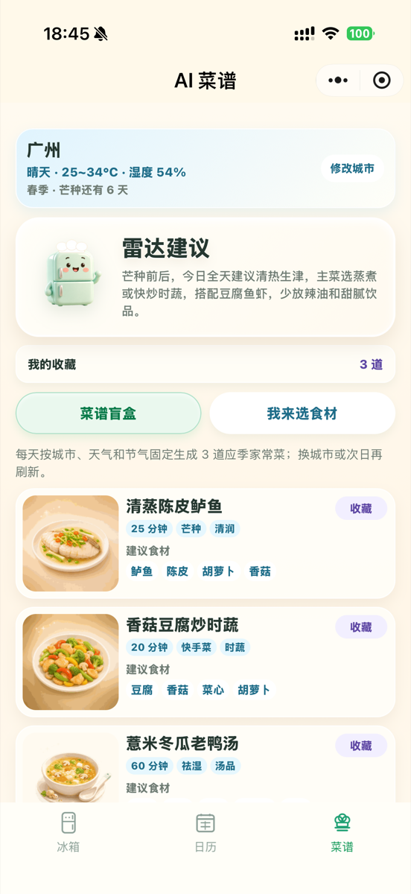

# 冰箱小雷达微信小程序

冰箱小雷达是一个微信小程序，用来管理家庭冰箱中的食品和饮料库存。它帮助用户记录食材、查看存放分区、跟踪过期日期，并把临期食材转化为可执行的菜谱建议。

English name: Fridge Radar

本项目为微信小程序原生开发。早期的 React/Vite H5 脚手架已彻底移除，仓库即为纯小程序工程。

## Screenshots

<table>
  <tr>
    <td align="center">
      
      <br />
      <sub>Fridge inventory</sub>
    </td>
    <td align="center">
      
      <br />
      <sub>Expiry calendar</sub>
    </td>
    <td align="center">
      
      <br />
      <sub>Cookability report</sub>
    </td>
    <td align="center">
      
      <br />
      <sub>AI recipes</sub>
    </td>
  </tr>
</table>

## 当前功能

- 首页展示可 DIY 的分区货架，支持冷藏、冷冻、门上储物格、果蔬抽屉、变温区启用和排序。
- 首页分区本身作为添加入口，分区食品通过横向卡片查看。
- 首页用“确定放哪 / 不确定放哪”两个指示牌表达录入路径。
- 点击首页分区进入添加方式面板，点击分区统计查看对应食品清单，点击食品图片查看、编辑、删除。
- 支持添加、编辑、删除食品。
- 支持全局统计：总食品数、临期食品、已过期食品。
- 支持搜索食品。
- 日历页展示到期食品。
- 日历页提供临期去化模块，展示今日到期、3 天内、7 天内和已过期食品，并直接生成 3 道去化推荐菜谱卡片。
- 菜谱页当前是 AI 菜谱体验版，已接入云函数 AI 路径和腾讯实时天气。
- 菜谱页雷达建议独立根据城市、天气、温度、湿度和季节 / 节气生成，不随下方选菜结果变化。
- 菜谱盲盒不读取冰箱库存，只根据雷达气候信息推荐应季养生家常菜。
- 我来选食材只围绕料理碗里的库存 / 临时食材生成，生成结果会保留到用户主动清空。
- 菜谱页支持收藏菜谱，并在“我的收藏”中查看记录。
- AI 菜谱页进入后默认等待用户选择入口，不自动展示临期去化内容。
- 首页提供“智能录入”入口。
- 智能录入支持手动输入名称后推荐分区。
- 分区弹窗内支持手动添加、拍食品、拍包装。
- 拍食品、拍包装、拍购物小票都会经过识别确认页，确认后才保存。
- 添加和识别确认流程不再要求填写数量、单位；保存时使用兼容默认值。
- 存放分区只保留冷藏、冷冻、门架、果蔬抽屉、变温 5 个标准分区。
- 日历页库存弹窗支持直接删除食品。

## 技术栈

- 微信小程序原生开发
- JavaScript
- WXML
- WXSS
- 微信云开发 / Tencent CloudBase
- CloudBase 云数据库
- CloudBase 云函数

云开发资源：

- AppID: `wx328e2b87665508e7`
- CloudBase 环境 ID: `cloud1-d3g4v0ms8ee56bd94`
- 云数据库集合：`items`、`reminders`、`parseLogs`、`fridgeZoneConfigs`、`recipeRecords`
- 云函数：`getOpenId`、`parseFoodImage`、`parseBarcode`、`generateRecipes`、`sendExpiryReminders`

说明：以上 AppID 和 CloudBase 环境 ID 是项目配置标识，不是可复用密钥。Fork 本项目时应替换成自己的微信小程序 AppID 和 CloudBase 环境。

## 仓库结构

```text
.
├── app.js                         # 小程序启动和 CloudBase 初始化
├── app.json                       # 页面和 Tab 配置
├── app.wxss                       # 全局样式
├── cloudfunctions/                # CloudBase 云函数
├── custom-tab-bar/                # 自定义 TabBar
├── images/                        # 本地产品视觉素材
├── pages/                         # 小程序页面
├── services/                      # 业务逻辑和 CloudBase 访问
├── styles/                        # 共享样式
├── utils/                         # 常量、日期、状态工具
├── docs/                          # 开源说明、CloudBase 设置和使用证明
└── project.config.json            # 微信开发者工具配置
```

## 本地运行

1. 打开微信开发者工具。
2. 导入本仓库目录。
3. 使用项目内 `project.config.json`。
4. 确认开发者工具识别到：
   - `miniprogramRoot: "./"`
   - `cloudfunctionRoot: "cloudfunctions/"`
5. 编译运行小程序。

Fork 用户需要配置自己的 CloudBase 环境。详细步骤见 [docs/CLOUDBASE_SETUP.md](docs/CLOUDBASE_SETUP.md)。

## 验证命令

本项目无构建步骤，提交前用 Node 语法检查关键脚本，并在微信开发者工具中编译运行：

```bash
node --check app.js
node --check services/itemService.js
node --check services/parseService.js
node --check services/recipeService.js
node --check services/recipeRecordService.js
node --check pages/index/index.js
node --check pages/item-form/item-form.js
node --check pages/quick-add/quick-add.js
node --check pages/parse-confirm/parse-confirm.js
node --check pages/batch-parse-confirm/batch-parse-confirm.js
node --check pages/calendar/calendar.js
node --check pages/recipes/recipes.js
node --check cloudfunctions/generateRecipes/index.js
```

## 当前不做

- 不做 Vercel 部署。
- 不接 Supabase。
- 不把 React H5 作为主线。
- 不做 Next.js。
- 不做独立后端服务器。
- 不做登录页。
- 不接真实条形码商品库。
- 真实天气通过云函数调用腾讯位置服务，小程序前端不直接保存 API key。
- 不接真实联网搜索。
- 不做订阅消息真实推送。

AI、OCR、天气、菜谱生成相关能力应留在云函数侧，小程序前端不能保存或暴露服务商 API key。

## 开源准备

当前仓库已补充开源协作和申请材料：

- [CONTRIBUTING.md](CONTRIBUTING.md)：贡献说明
- [SECURITY.md](SECURITY.md)：安全问题报告方式
- [CHANGELOG.md](CHANGELOG.md)：版本记录
- [OPEN_SOURCE_APPLICATION.md](OPEN_SOURCE_APPLICATION.md)：Codex for Open Source 申请准备说明
- [docs/USAGE_EVIDENCE.md](docs/USAGE_EVIDENCE.md)：使用证明和后续证据清单
- `.github/ISSUE_TEMPLATE/`：GitHub issue 模板

## 重要说明

- `src/`、`dist/`、`public/`、`package.json`、`vite.config.ts`、`tsconfig*.json`、`eslint.config.js`、`index.html` 等旧 H5/Vite 相关内容已彻底移除，仓库即为纯微信小程序工程。
- 当前阶段优先稳定上线：AI 相关能力（菜谱生成、拍照/拍包装/小票识别）通过 `utils/featureFlags.js` 统一收起，默认关闭，后续可逐项开启。
- 条形码扫描模块已从用户入口移除；后续如恢复，需要重新确认低成本商品库方案。

## Contributing

Contributions are welcome. Please start by reading [CONTRIBUTING.md](CONTRIBUTING.md).

Good first contribution areas:

- documentation improvements
- setup guide corrections
- UI copy improvements
- CloudBase deployment notes
- small bug fixes with clear reproduction steps

## Security

Please read [SECURITY.md](SECURITY.md) before reporting sensitive issues.

## License

This project is licensed under the MIT License. See [LICENSE](LICENSE).
